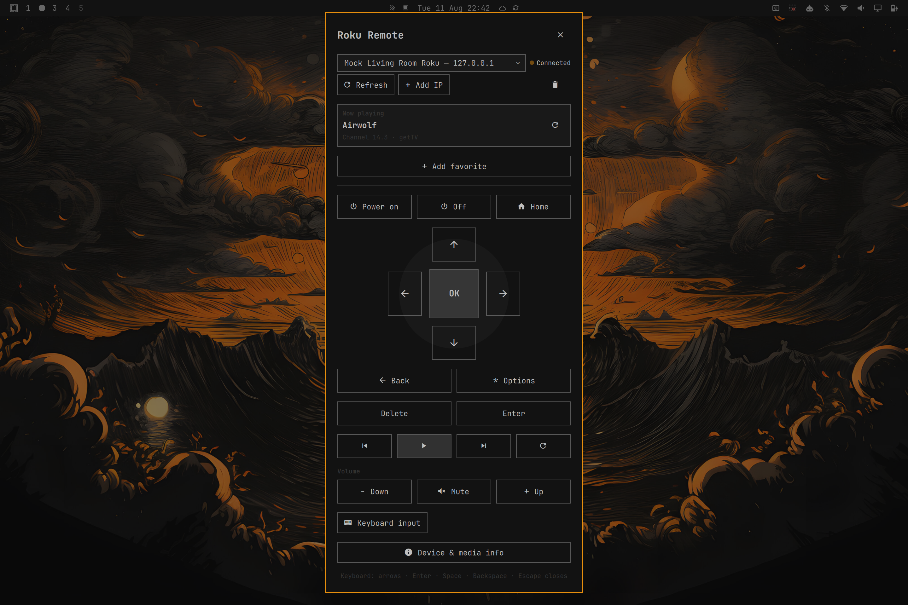

# Roku Remote for Omarchy

[](https://github.com/Jalv13/omarchy-roku-remote/actions/workflows/ci.yml)


A native Omarchy Quattro/Quickshell panel for controlling Roku TVs and Roku
streaming players over the local-network External Control Protocol (ECP).
There is no cloud account, telemetry, browser, Electron runtime, or listening
server.



## Features

- SSDP discovery using `ST: roku:ecp` on `239.255.255.250:1900`, with a
  bounded local-subnet `8060` fallback when multicast replies are filtered
- Manual private IPv4 addresses when multicast discovery is unavailable
- Multiple-device selector with friendly names from `/query/device-info`
- Home, Back, Info/Options, full navigation, playback, replay, power, volume,
  and mute where the Roku supports them
- Mouse/touch long-press for directional buttons through ECP `keydown` and
  `keyup`, with an automatic safety release
- Focused-panel keyboard control and optional Roku literal text input
- Per-device favorite apps and TV channels with one-click ECP launch buttons;
  installed apps are offered automatically when Roku permits `/query/apps`,
  with Roku-provided icon previews and a manual app-ID fallback
- On-demand media and active-TV-channel details; no background polling
- URL-encoded app deep links plus opt-in developer diagnostics through IPC or
  the dependency-free helper
- Native `Color`, `Style`, `BorderSurface`, `Button`, `Dropdown`, `TextField`,
  and `PanelToolTip` integration; colors, borders, type, spacing, focus, hover,
  pressed states, and tooltips follow the active Omarchy theme
- Persistent selected/manual devices in
  `~/.local/state/omarchy/settings/roku-remote.json`

## Requirements

- Omarchy 4 (Quattro) with `omarchy-shell`
- Quickshell 0.3 or newer
- Python 3 (standard library only)
- A Roku with **Settings → System → Advanced system settings → Control by
  mobile apps → Network access** set to **Enabled**. Roku OS 14.1 and newer
  requires this for `keypress`, `keydown`, and `keyup` commands (see Roku's
  [official ECP documentation](https://developer.roku.com/dev/docs/external-control-api)).
- The Linux machine and Roku on the same LAN; client isolation must not block
  multicast or TCP port `8060`

## Installation

Install directly from the public GitHub repository:

```bash
omarchy plugin add https://github.com/Jalv13/omarchy-roku-remote.git --enable
```

When prompted, choose where the Roku Remote icon should appear in the bar. The
right section is the recommended default. After installation, click the Roku
Remote icon in the bar to open or close the panel.

Installation uses Omarchy's standard plugin manager. It clones this repository
into the plugin-specific directory and changes the shell layout only because
`--enable` was explicitly supplied. The plugin has no installer script and
does not overwrite Hyprland bindings or other user configuration.

Update or remove it later with:

```bash
omarchy plugin update io.github.jalv13.roku
omarchy plugin remove io.github.jalv13.roku
```

For local development, copy this directory without symlinks and rescan:

```bash
cp -a ./roku-remote ~/.config/omarchy/plugins/io.github.jalv13.roku
omarchy-shell shell rescanPlugins
omarchy plugin enable io.github.jalv13.roku --section right
```

Validate a checkout before installation:

```bash
omarchy plugin validate ./roku-remote
```

## Open the remote

If the plugin was installed without `--enable`:

```bash
omarchy plugin enable io.github.jalv13.roku --section right
```

Click the Roku Remote icon in the bar to toggle the panel. The icon follows the
active Omarchy bar theme and can be moved later with the standard bar controls.

As a power-user alternative, toggle, explicitly open, or hide the panel through
Omarchy IPC:

```bash
omarchy-shell shell toggle io.github.jalv13.roku '{}'
omarchy-shell shell summon io.github.jalv13.roku '{}'
omarchy-shell shell hide io.github.jalv13.roku
```

The keep-loaded plugin also exposes a small direct IPC target:

```bash
omarchy-shell roku refresh
omarchy-shell roku sendKey Home
omarchy-shell roku launchApp 837
omarchy-shell roku launchDeepLink 837 1234 movie
omarchy-shell roku launchChannel 5.1
omarchy-shell roku iconUrl 837
omarchy-shell roku refreshStatus
omarchy-shell roku diagnostic chanperf
omarchy-shell roku exitApp dev true
omarchy-shell roku addFavorite app 837 YouTube
omarchy-shell roku removeFavorite app 837
omarchy-shell roku forget 192.168.1.50
omarchy-shell roku state
```

## Keyboard shortcut

Check the current bindings first:

```bash
omarchy menu keybindings --print
```

On a standard Quattro install, `SUPER + R` is free. Add this to
`~/.config/hypr/bindings.lua`:

```lua
o.bind("SUPER + R", "Roku Remote", "omarchy-shell shell toggle io.github.jalv13.roku '{}'")
```

Hyprland reloads Lua configuration automatically. Validate after saving:

```bash
hyprctl reload
hyprctl configerrors
```

If your current configuration already binds `SUPER + R`, place
`hl.unbind("SUPER + R")` immediately before the new `o.bind(...)`, or choose a
different shortcut.

## Using the remote

Open the panel and wait briefly for discovery. The plugin sends two bounded
SSDP searches and deduplicates replies. If there are no replies, it checks only
the directly connected IPv4 subnet (at most 512 addresses, with short TCP
timeouts) for ECP port `8060`. It then queries candidates' device-info XML. It
does not poll continuously; reopening after a minute or pressing **Refresh**
starts a new scan.

Panel keyboard mappings:

| Key | Roku action |
|---|---|
| Arrow keys | Up / Down / Left / Right |
| Enter | Select / OK |
| Backspace | Back |
| Home | Home |
| Space | Play / Pause |
| Escape | Close panel |

Directional buttons support holding. A safety timer always schedules `keyup`
even if the pointer release is lost.

## Manual IP configuration

Choose **Add IP**, enter a private/local IPv4 address such as
`192.168.1.50`, and press **Add**. Public addresses and hostnames are rejected.
The Roku remains in the selector while offline and can be removed with the
trash button. No account credentials are stored.

## Text input

Choose **Keyboard input**, focus a text box on the Roku itself, type up to 256
characters, and press **Send**. The helper emits one URL-encoded ECP
`Lit_<character>` keypress per character. Roku screens that do not accept
literal input simply ignore it.

## Favorite apps and TV channels

Choose **Add favorite**. If Roku allows its installed-app list, search for an
app such as YouTube in the autocomplete picker; its name and ID fill automatically.
Otherwise enter a short name and the app ID shown by Roku's local
`/query/apps` endpoint, then choose **Add app**.

For a Roku TV tuner, enter a label and channel number such as `5` or `5.1`,
then choose **Add TV channel**. Favorite buttons use Roku's local
`POST /launch/<app-id>` and `POST /launch/tvinput.dtv?ch=<channel>` endpoints.
They are stored per Roku device, capped at 12, and follow a device when DHCP
changes its IP. Saved favorites appear directly below the directional pad in
full-width rows of up to four evenly sized buttons.
Open **Add favorite** to reveal the remove buttons.

The current Roku Network access policy may block app discovery or launching.
Manual entry remains available, and the panel reports a launch failure without
hanging or sending navigation presses.

## Media information and power-user tools

The compact **Now playing** section refreshes when the panel opens or the
selected Roku changes. It shows the current app or live-TV program, playback
state, and position when supported. Use its refresh button for another
on-demand snapshot; the plugin does not poll in the background.

Open **Device & media info** for the same playback snapshot alongside Roku
model and software details.

Developer-mode queries stay out of the normal remote UI. Run one through IPC,
then read its structured result from `omarchy-shell roku state`, or call the
helper directly:

```bash
./scripts/roku_ecp.py status --ip 192.168.1.50
./scripts/roku_ecp.py query --ip 192.168.1.50 --name chanperf
./scripts/roku_ecp.py query --ip 192.168.1.50 --name graphics-frame-rate
./scripts/roku_ecp.py query --ip 192.168.1.50 --name r2d2-bitmaps
./scripts/roku_ecp.py query --ip 192.168.1.50 --name sgnodes
./scripts/roku_ecp.py query --ip 192.168.1.50 --name registry
./scripts/roku_ecp.py exit-app --ip 192.168.1.50 --id dev --force
```

These diagnostic endpoints and `exit-app` require Roku Developer Mode and
mobile-app network access. Helper output remains a single JSON object so it is
easy to inspect or script without another dependency.

## Testing

Run the unit/integration suite:

```bash
./tests/run-tests
```

It covers SSDP parsing and deduplication, malformed responses, no-result
discovery behavior, ECP key and launch URL generation, device-info and
installed-app XML parsing, mock app/TV-channel launches, actionable HTTP 403
handling, refusal, timeout, invalid input, and device disappearance.

For interactive network testing without a Roku:

```bash
./tests/mock_roku.py
./scripts/roku_ecp.py info --ip 127.0.0.1
./scripts/roku_ecp.py control --ip 127.0.0.1 --action keypress --key Home
```

The mock binds only to loopback by default.

## Troubleshooting

- **No Roku found:** verify both devices are on the same subnet, disable Wi-Fi
  client/AP isolation, check Roku's mobile-app network-access setting, then use
  **Add IP** if multicast is filtered.
- **Offline:** verify `curl http://ROKU_IP:8060/query/device-info` works from
  the Linux machine. Refresh after a DHCP address change; stable device IDs let
  the plugin follow a rediscovered device to its new IP.
- **Volume works but navigation gets HTTP 403:** the Roku is in **Limited**
  network-access mode. On Roku OS 14.1+, set **Control by mobile apps → Network
  access** to **Enabled** using the physical remote. Device discovery/info and
  TV volume can work while Roku still blocks navigation and playback commands.
- **Power/volume does nothing:** these commands are device-dependent. The
  plugin reports an unsupported HTTP response without freezing or closing.
- **Panel does not load:** run `omarchy plugin validate` and inspect shell logs
  with `journalctl --user -u omarchy-shell -n 100 --no-pager`.
- **Theme looks stale:** run `omarchy restart shell`; the panel otherwise binds
  directly to live Omarchy theme tokens.

## Dependencies and license

The source is licensed under the [MIT License](LICENSE). It contains no vendored
libraries, fonts, icons, binaries, or copied Roku assets. Runtime dependencies
are limited to the Omarchy/Quickshell APIs already present on Omarchy 4 and
Python 3's standard library; the test suite also uses only the standard
library.

Roku is a trademark of Roku, Inc. This is an unofficial local-network client
and is not affiliated with or endorsed by Roku, Inc.

For data handling, vulnerability reports, and troubleshooting help, see
[Privacy](PRIVACY.md), [Security](SECURITY.md), and [Support](SUPPORT.md).

## Uninstallation

Use Omarchy's standard remover for a Git-installed plugin:

```bash
omarchy plugin remove io.github.jalv13.roku --yes
```

This unloads the plugin, removes its bar registration, and deletes only its
installed checkout at
`~/.config/omarchy/plugins/io.github.jalv13.roku`. The plugin has no removal
script and does not delete unrelated configuration.

The small state file is intentionally retained so an update or reinstall does
not unexpectedly erase selected devices or favorites. To erase that data too,
remove this exact file separately:

```bash
rm -- ~/.local/state/omarchy/settings/roku-remote.json
```

Remove any Roku shortcut line you added to `~/.config/hypr/bindings.lua`, then
run `hyprctl reload` and `hyprctl configerrors`.
